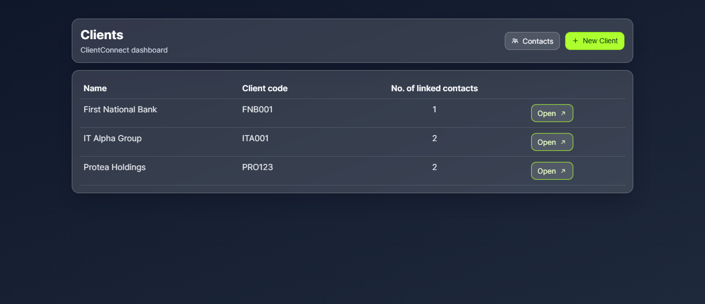
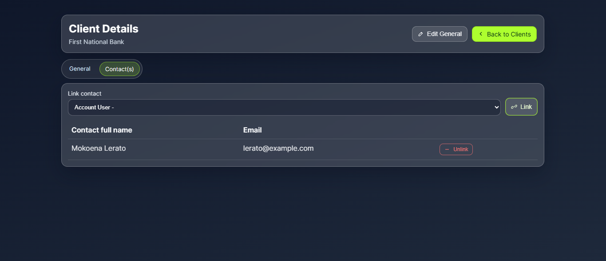
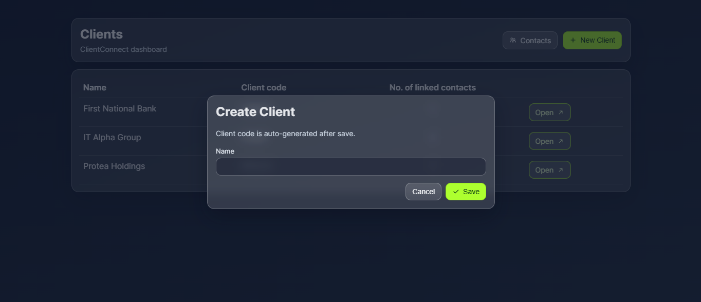
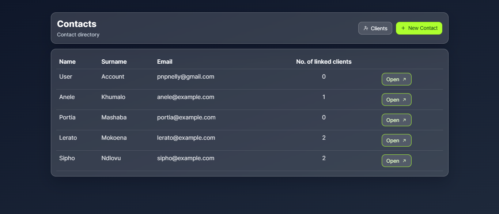
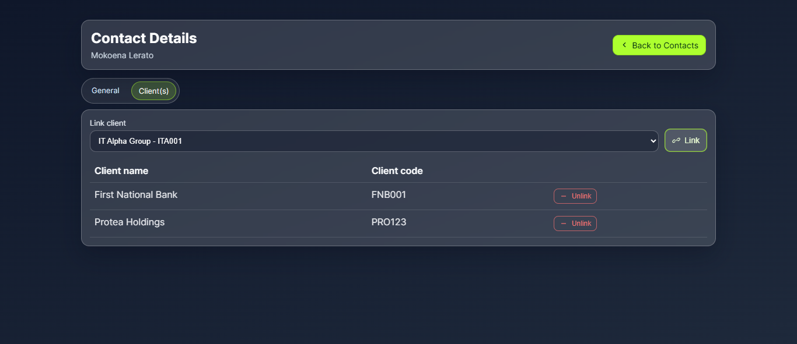
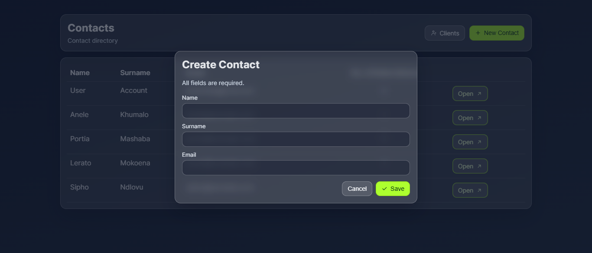

# ClientConnect App 

ClientConnect is a framework-free PHP + MySQL application for managing clients, contacts, and the links between them.

The app includes:
- Client and Contact CRUD entry points (create + list + details)
- Link/unlink between clients and contacts
- Client code auto-generation
- Validation (including email format + uniqueness)
- Pagination on list screens (5 per page, display-only)
- Glassmorphism UI with favicon and responsive layouts



---

## Tech Stack

- PHP 8+
- MySQL 8+ (or compatible MariaDB)
- Plain JavaScript
- PDO (database access)

---

## Clone the Repository

```bash
git clone https://github.com/Portia-Nelly-Mashaba/ClientConnect-App.git
cd ClientConnect-App
```

---

## Project Structure

- `app/` - controllers, repositories, services, requests, views
- `bootstrap/` - app bootstrapping
- `config/` - app and database config
- `database/` - SQL schema, migrate script, seed script
- `public/` - front controller and static assets (favicon)
- `routes/` - route definitions
- `images/` - README screenshots

---

## Setup Instructions

### 1) Configure your database

Edit:

- `config/database.php`

Set your local values for:

- `host`
- `port`
- `database` (default expected: `clientconnectapp`)
- `username`
- `password`
- `charset`

### 2) Run migration

Creates database + tables from SQL schema:

```bash
php database/migrate.php
```

### 3) Run seeder (recommended)

Adds sample clients, contacts, and link records:

```bash
php database/seed.php
```

### 4) Start the app

From project root:

```bash
php -S localhost:8000 -t public
```

Open in browser:

- <http://localhost:8000>

---

## Available Routes

- `/clients` - clients list (paginated)
- `/clients/{id}` - client details + link/unlink contacts
- `/contacts` - contacts list (paginated)
- `/contacts/{id}` - contact details + link/unlink clients
- `/health/db` - DB health check

---

## Business Rules Implemented

- **Client code generation**
  - auto-generated after client creation
  - unique format (3 letters + 3 digits), e.g. `FNB001`
- **Contacts**
  - name, surname, email are required
  - email format validated
  - email uniqueness enforced
- **Linking**
  - one contact can be linked to multiple clients
  - duplicate links are blocked
  - unlink supported from both details screens
- **Pagination**
  - 5 records per page
  - applies to display lists only (no creation limit)

---

## UI Screenshots

### Client Details



### Client Form



### Contacts Index



### Contact Details



### Contact Form



---

## Troubleshooting

- **`Base table or view not found`**
  - Run migration:
    - `php database/migrate.php`

- **Seeder not applied**
  - Run:
    - `php database/seed.php`

- **Database connection errors**
  - Verify `config/database.php` and confirm MySQL is running.

- **Port 8000 already in use**
  - Run on another port:
    - `php -S localhost:8080 -t public`

---

## Notes

- This project intentionally uses plain PHP (no framework) to demonstrate core MVC and SQL fundamentals.
- UI and navigation are optimized for clarity in assessment/demo scenarios.
